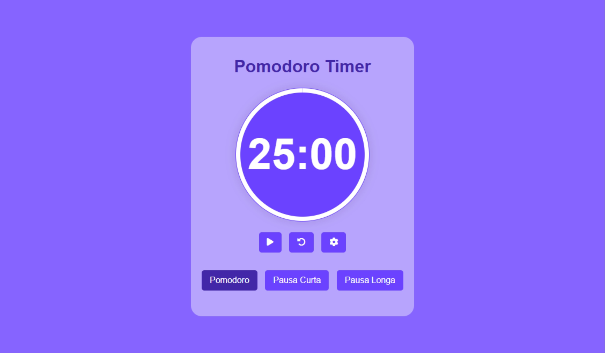

# Pomodoro Timer

## Sobre o projeto

Um timer baseado na técnica Pomodoro. A Técnica Pomodoro é um método de gerenciamento de tempo para aumentar sua produtividade. Esse timer possui os intervalos de tempo mais comumente utilizados na técnica. Mas também é possível alterá-los.

## Como utilizar

Escolha entre um dos intervalos de tempo e clique no botão iniciar, ao finalizar o tempo soará um lembrete musical, para alterar o tempo dos intervalos, clique no botão de configurações (ícone de engrenagem)

## Informações

Projeto desenvolvido utilizando apenas HTML, CSS e JavaScript.

